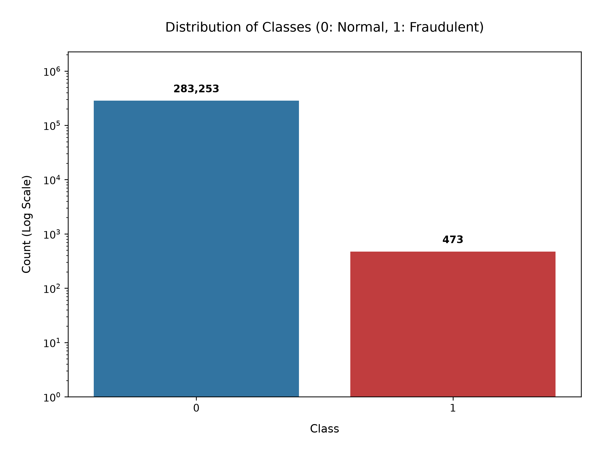
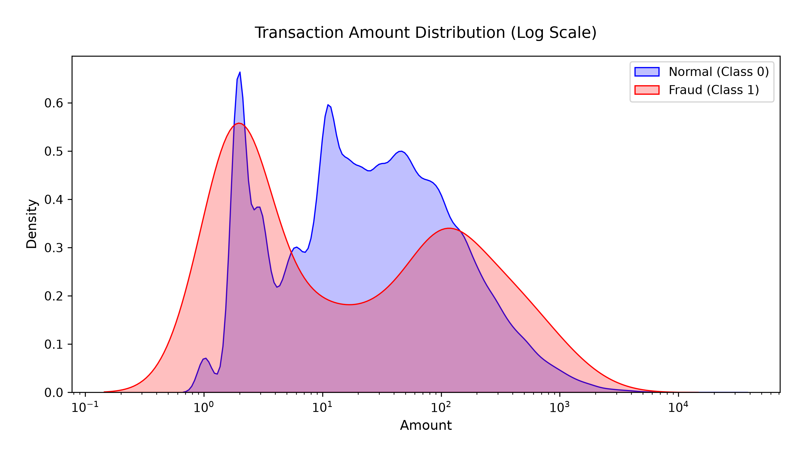
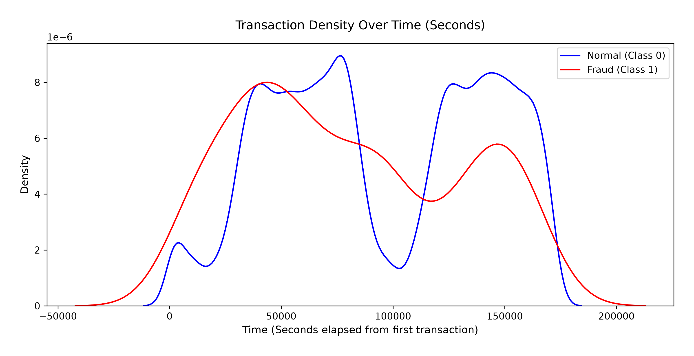
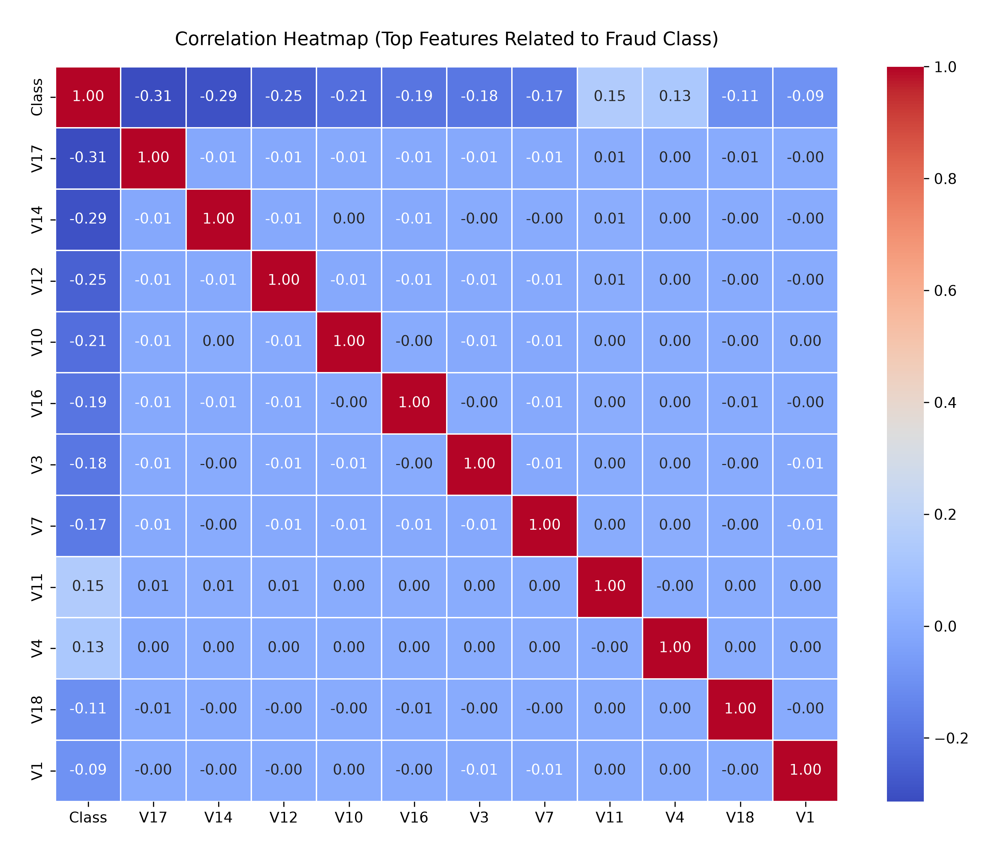
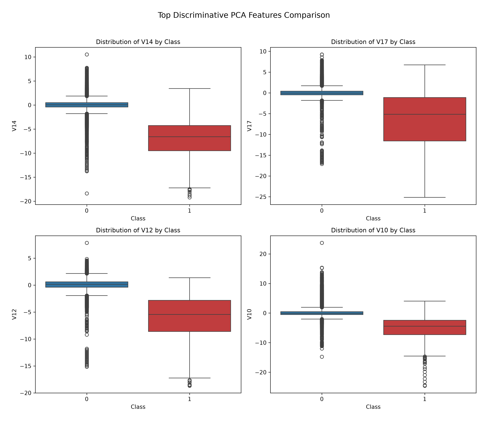
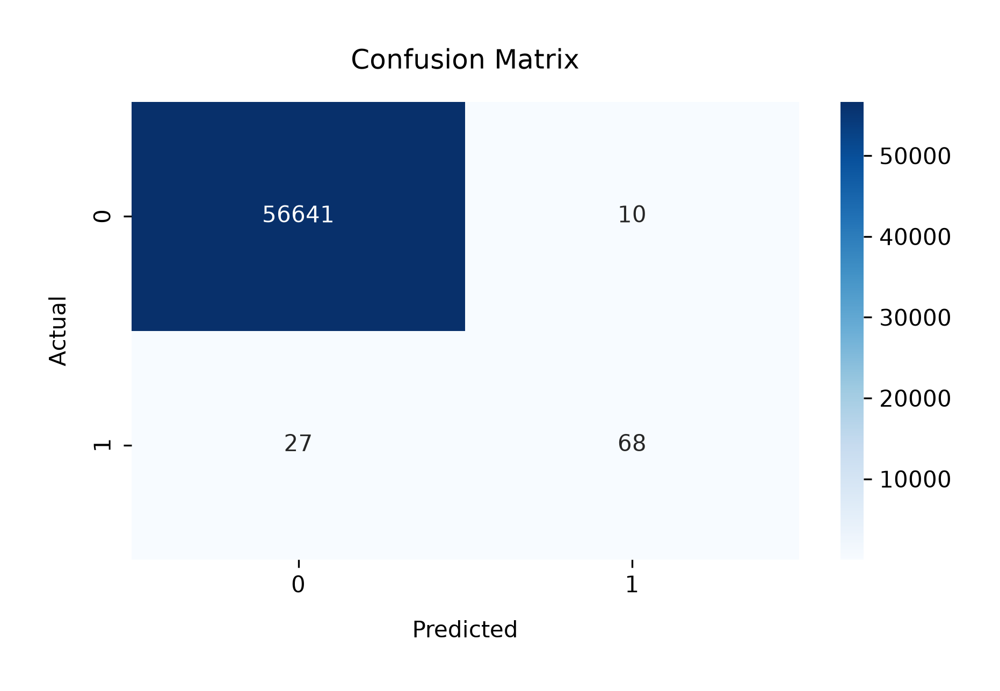

# Credit card Fraud Detection Engine

---

A modular machine learning pipeline built to detect fraudulent credit card transactions for the Biometric DID System. The pipeline automates data cleaning, exploratory data analysis (EDA), feature engineering, and neural network model training with targeted evaluation thresholding.

---

## Architecture Overview

The pipeline is orchestrated sequentially by `main.py` across four modular Python scripts located in the `research/` directory:

```text
[ ../data/creditcard.csv ] (Raw Data: 284,807 rows)
            │
            ▼
┌───────────────────────┐
│   data_cleaning.py    │ ──► Identifies & removes nulls + duplicate rows
└───────────────────────┘     Saves: ../data/creditcard_cleaned.csv
            │
            ▼
┌───────────────────────┐
│   data_analysis.py    │ ──► Generates 5 EDA plots (Log distribution, KDE, Boxplots)
└───────────────────────┘     Saves: ../output/graphs/*.png
            │
            ▼
┌───────────────────────┐
│ feature_engineering.py│ ──► StandardScales 'Amount' & 'Time', drops raw columns,
└───────────────────────┘     performs stratified 80/20 train/test split
            │
            ▼
┌───────────────────────┐
│       model.py        │ ──► Trains Keras Sequential Neural Network
└───────────────────────┘     Evaluates using 0.35 probability threshold
            │
            ├──► Saves Tabular Metrics: ../output/csv/classification_report.csv
            ├──► Saves Confusion Matrix: ../output/graphs/confusion_matrix.png
            └──► Saves Model File: ../output/model/fraud_detection_model.h5

```

---

## System Requirements & Dependencies

1. Python Version: Python 3.9 – 3.11

2. Hardware: Webcam access for live facial optical capture

## Core Python Packages (`requirements.txt`) 
1. pandas
2. matplotlib
3. numpy
4. seaborn
5. scikit-learn
6. keras
7. tensorflow

---

## Project Directory Structure

To run biometric_did.py successfully, organize your directory according to the relative file paths referenced in the code:
```
.
├── output/
│   ├── csv/
│   │   └── classification_report.csv            # Tabular classification report (4 decimal precision)
│   ├── graphs/
│   │   ├── amount_distribution.png               # Log-scale transaction amount KDE
│   │   ├── class_distribution.png                # Log-scale class count plot with annotations
│   │   ├── confusion_matrix.png                  # Evaluation heatmap
│   │   ├── discriminative_features_boxplot.png   # Boxplots for top PCA features (V14, V17, V12, V10)
│   │   ├── time_distribution.png                 # Transaction density over time
│   │   └── top_correlation_heatmap.png           # Heatmap of top correlated features
│   └── model/
│       └── fraud_detection_model.h5             # Serialized trained Keras neural network model
├── research/
│   ├── data_analysis.py                          # Exploratory data analysis & graph generation module
│   ├── data_cleaning.py                         # Data cleaning & deduplication module
│   ├── feature_engineering.py                    # Feature scaling & stratified train/test split module
│   ├── main.py                                   # Pipeline master entry point script
│   └── model.py                                  # Keras Neural Network build, train, & evaluation module
├── .gitignore
├── README.md
└── requirements.txt                             # Project Python dependencies
```

---

## Dataset & Behavioral Benchmarks

The AI Behavioral Fraud Engine relies on the **Credit Card Fraud Detection** benchmark dataset to train its fraud risk prediction core prior to initiating step-up biometric challenges:

* **Dataset**: [Credit Card Fraud Detection (Kaggle)](https://www.kaggle.com/datasets/mlg-ulb/creditcardfraud)
* **Source**: Machine Learning Group - ULB
* **Dataset Characteristics**: Contains 284,807 European cardholder transactions across two days, featuring 492 fraudulent transactions (0.172% imbalance ratio).
* **Features**: Includes 28 PCA-transformed numerical features ($V1$ to $V28$) along with transaction `Time` and `Amount`.
* **Pipeline Integration**: Acts as the behavioral feature baseline for risk scoring; transactions exceeding the risk threshold ($\text{Risk Score} \ge 0.30$) trigger step-up optical camera scanning and FaceNet verification.

---

## Installation & Setup

1. **Clone Repository**
    * `git clone [https://github.com/pikum06/biometric-did-engine.git](https://github.com/pikum06/biometric-did-engine.git)`
    * `cd biometric-did-engine`

2. **Create and Activate a Virtual Environment:**
    * `python3 -m venv .venv`
    * `source .venv/bin/activate`  # On Windows: `.venv\Scripts\activate`

3. **Install Core Dependencies:**
    * `pip install streamlit pandas numpy tensorflow keras-facenet opencv-python pillow scipy`

4. **Dataset Placement**

* Ensure your raw dataset `creditcard.csv` is placed in the data/ directory at the project root level: `data/creditcard.csv`.

6. **Running the Application**
    * `cd research`
    * `python3 main.py`

### Pipeline Steps Executed by main.py:

1. **`data_cleaning.py:`** Reads `../data/creditcard.csv`, scans for null values and duplicate rows, removes detected duplicate entries (~1,081 rows), and outputs `../data/creditcard_cleaned.csv.`

2. **`data_analysis.py:`** Loads the cleaned CSV and exports 5 high-resolution visualization graphs to `../output/graphs/`.

3. **`feature_engineering.py:`** Fits StandardScaler to Amount and Time features, drops the raw unscaled columns, and performs a stratified 80/20 train/test split.

4. **`model.py:`**

* Constructs a 4-layer Keras Sequential Neural Network (`Dense(32) -> Dropout(0.2) -> Dense(16) -> Dense(1, sigmoid)`).

* Compiles with `adam` optimizer and `binary_crossentropy` loss.

* Trains over 10 epochs with a batch size of 2048.

* Predicts test set probabilities and applies an optimized decision threshold of `0.35`.

* Exports `classification_report.csv` to `../output/csv/`, `confusion_matrix.png` to `../output/graphs/`, and saves the compiled model `fraud_detection_model.h5` to `../output/model/`. 

---

## Output Graphs

1. **class_distribution.png**



This figure demonstrates the extreme class imbalance in the credit card transaction dataset following deduplication (283,253 legitimate transactions vs. 473 fraudulent instances). Plotting the distribution on a logarithmic Y-axis ($10^0$ to $10^6$) with explicit count annotations preserves sample magnitude while rendering the minority fraud class clearly visible as shown in the above figure.

2. **amount_distribution.png**



A Kernel Density Estimation (KDE) plot overlaying transaction amounts on a logarithmic scale ($10^{-1}$ to $10^4$ USD). Legitimate transactions (Class 0) exhibit multi-modal spending clusters across standard commercial payment tiers, whereas fraudulent transactions (Class 1) display a bimodal concentration around micro-card testing and high-value liquidity drains, proving transaction magnitude serves as a strong behavioral indicator as shown in the above figure.

3. **time_distribution.png**



Kernel density estimation of transaction timestamps elapsed over two complete diurnal cycles ($0$ to $172,800$ seconds). Normal transaction volume exhibits distinct human circadian rhythm troughs during off-peak night windows (~$75,000$ to $110,000$ seconds), whereas fraudulent activity maintains an elevated relative density during low-volume off-peak hours, establishing temporal execution timing as a key discriminative feature as shown in the above figure.

4. **top_correlation_heatmap.png**



Pearson correlation matrix isolating the top 12 principal component features exhibiting the strongest linear relationship with the target fraud variable. The heatmap identifies key inverse correlations ($V_{17} = -0.31$, $V_{14} = -0.29$, $V_{12} = -0.25$, $V_{10} = -0.21$) and positive correlations ($V_{11} = +0.15$, $V_{4} = +0.13$) that drive the neural network's boundary separation as shown in the above figure.

5. **discriminative_features_boxplot.png**



Comparative boxplots analyzing the distribution of the four most discriminative PCA features ($V_{14}$, $V_{17}$, $V_{12}$, and $V_{10}$) across normal and fraudulent classes. The plots illustrate distinct structural separation in feature space, where fraudulent transactions consistently exhibit significant negative median shifts and heavy lower-tail outlier spreads compared to normal transactions as shown in the above figure.

6. **confusion_matrix.png**



Confusion matrix heatmap evaluating neural network predictions on the held-out 20% test dataset (56,746 samples) at an optimized decision threshold of $T_{\text{risk}} = 0.35$. The model achieves 56,641 True Negatives and 68 True Positives (detecting 71.6% of unique fraud cases) while keeping False Positives constrained to 10 as shown in the above figure.

---


          
