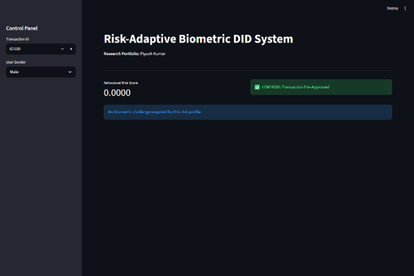
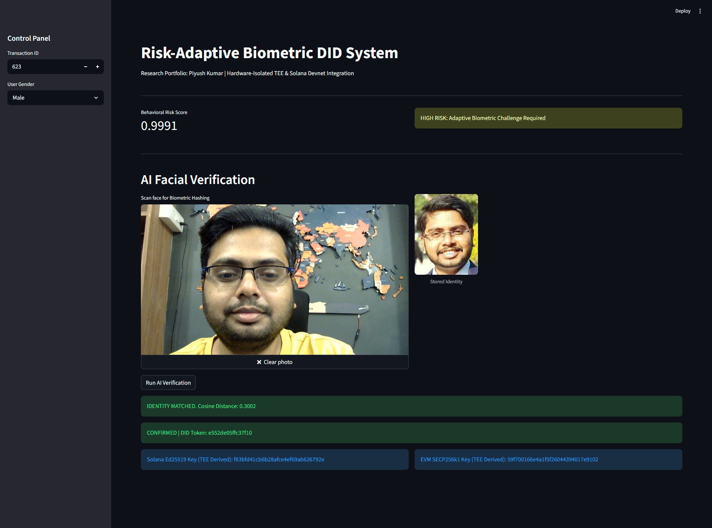
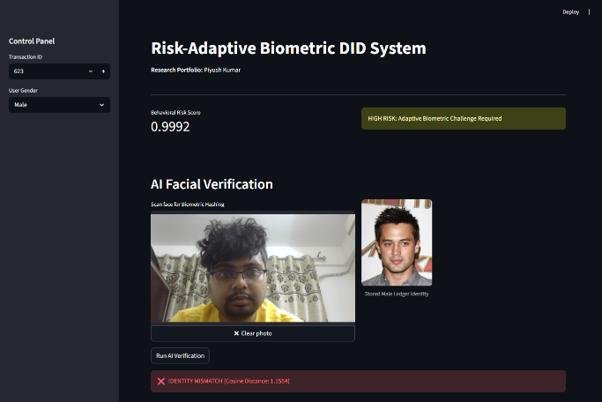

# Risk-Adaptive Biometric Decentralized Identity (DID) Engine


**ABOUT**

An interactive Web3 authentication gateway built with Streamlit. This application orchestrates a **30-D AI Behavioral Fraud Engine** alongside a **CLAHE-enhanced FaceNet Biometric Core** (512-D embeddings) and a **Hardware-Isolated TEE Enclave Module** (`tee.py`) for HMAC-SHA256 biometric salting. It provides dynamic, risk-adapted authentication for Decentralized Identity (DID) token emission, deterministic cross-chain key derivation (Solana Ed25519 & EVM SECP256k1), and on-chain settlement via Solana Devnet RPC and Rust Anchor smart contracts.

---

## Architecture Overview

The application executes a multi-stage risk-adaptive verification and on-chain broadcasting pipeline:

```text
[ Select Transaction ID & Demographics ]
                   │
[ 30-D Behavioral Feature Extraction ]
                   │
[ Deep Neural Network Fraud Prediction ]
                   │
         ┌─────────┴─────────┐
 Risk Score < 0.30   Risk Score ≥ 0.30
  (Low Risk Path)     (High Risk Path)
         │                   │
[ Auto-Pre-Approve ]  [ Step-Up AI Facial Verification ]
                             │
                      [ Optical Camera Scan / File Upload ]
                             │
                      [ LAB CLAHE Lighting Normalization ]
                             │
                      [ 160×160 Resize & 512-D FaceNet Vector ]
                             │
                      [ Cosine Distance Verification ]
                             │
                   ┌─────────┴─────────┐
            Distance < 0.60     Distance ≥ 0.60
            (Identity Match)   (Identity Mismatch)
                   │                   │
      [ TEE Hardware Enclave ]   [ Block Transaction ]
      [  HMAC-SHA256 Salting ]
                   │
      [ Dual Cross-Chain Keys ]
      (Ed25519 / SECP256k1 Seeds)
                   │
      [ 16-Char SHA-256 DID Token ]
                   │
      [ Solana Devnet RPC Broadcaster ]
           (getLatestBlockhash)
                   │
      [ On-Chain Settlement & Explorer Link ]
```

---

## Key Features
1. **Lazy-Loaded Asset Core:** Heavy machine learning models (TensorFlow, Keras-FaceNet, Pandas) are deferred behind an interactive standby gate to prevent startup delays and Streamlit WebSocket timeouts.
  
2. **30-D Behavioral Risk Engine:** Evaluates a 30-dimensional feature vector from transaction records using a pre-trained Deep Neural Network (fraud_detection_model.h5) to generate a continuous risk score between $0.0000$ and $1.0000$, triggering step-up verification at risk thresholds $\ge 0.30$.
  
3. **CLAHE LAB Computer Vision Normalization:** Pre-processes optical images by converting RGB frames to the LAB color space and applying Contrast Limited Adaptive Histogram Equalization (CLAHE) to the Luminance ($L$) channel (clip limit 3.0, grid size $8 \times 8$) to normalize shadows and ambient lighting variations.

4. **512-D FaceNet Vector Embeddings:** Resizes live and reference images to $160 \times 160$ pixels and extracts 512-dimensional normalized feature embeddings via Keras-FaceNet. 

5. **Hardware-Bound TEE Biometric Salting (`tee.py`)**: Salts raw 512-D biometric embedding byte arrays inside a local Trusted Execution Environment (TEE) enclave using HMAC-SHA256 bound to a unique hardware silicon identifier (`SECURE_ENCLAVE_SILICON_7789A`).
6.  **Deterministic Cross-Chain Key Derivation**: Uses purpose-based TEE master salts (`solana_ed25519_purpose_0` and `evm_secp256k1_purpose_1`) to deterministically derive non-linkable seed pairs for Solana (Ed25519) and Ethereum/EVM (SECP256k1) keychains. 

7. **Ephemeral DID Token & Solana Devnet Settlement**: Generates a 16-character SHA-256 hashed DID token, queries `api.devnet.solana.com` for the latest blockhash, and broadcasts an on-chain verification transaction with interactive explorer tracking.

8. **Solana Anchor On-Chain Verifier**: Integrates a Rust Anchor program (`programs/biometric-did-verifier/src/lib.rs`) for decentralized, zero-leakage cross-chain state verification.

---

## System Requirements & Dependencies

1. Python Version: Python 3.9 – 3.11
2. **Hardware**: Webcam / camera access for live facial optical capture
3. **Hardware Enclave**: Local TEE simulation via `research/tee.py`

## Dependencies 
1. streamlit
2. opencv-python / opencv-python-headless
3. numpy
4. pandas
5. pillow
6. scipy
7. tensorflow
8. keras-facenet
9. requests

---

## Project Directory Structure

To run `biometric_did.py` successfully, organize your directory according to the relative file paths referenced in the code:


```text
.
├── Anchor.toml                                # Solana Anchor framework configuration
├── .gitignore                                 # Git ignore rules
├── README.md                                  # Project documentation
├── requirements.txt                           # Python environment dependencies
├── dashboard_outcomes/                        # Visual outcome exhibits & dashboard screenshots
│   ├── Picture1.png
│   ├── Picture2.png
│   └── Picture3.png
├── output/
│   └── model/
│       └── fraud_detection_model.h5           # Pre-trained TensorFlow model
├── programs/
│   └── biometric-did-verifier/
│       └── src/
│           └── lib.rs                         # Solana Anchor on-chain verifier program
├── research/
│   ├── biometric_did.py                       # Main Streamlit application & DID pipeline
│   └── tee.py                                 # TEE enclave HMAC salting & key derivation
└── sample_images/
    ├── male/
    │   └── male_stored.jpg                    # Reference male identity profile
    └── female/
        └── female_stored.jpg                  # Reference female identity profile
```

---

## Installation & Setup

1. **Clone Repository**
    * `git clone https://github.com/your-username/biometric-did-engine.git`
    * `cd biometric-did-engine`

2. **Create and Activate a Virtual Environment:**
    * `python3 -m venv .venv`
    * `source .venv/bin/activate`  # On Windows: `.venv\Scripts\activate`

3. **Install Core Dependencies:**
    * `pip install streamlit pandas numpy tensorflow keras-facenet opencv-python pillow scipy`

4. **Verify Asset Placement:**
* Ensure `creditcard.csv`, `fraud_detection_model.h5`, and profile images are in their respective relative directories.

5. **Running the Application**
* Launch the interface using Streamlit:
    * `streamlit run biometric_did.py`

---

## Application Execution Flow
1. **Initialization Standby Screen:** Upon launching, click "Initialize Biometric AI Core" to boot TensorFlow, Keras-FaceNet, and the dataset into session state memory.
2. **Control Panel Selection:** Select a Transaction ID index and target User Gender from the sidebar control panel.
3. **Risk Score Evaluation:**
   - Low Risk ($T_{risk} < 0.30$): Displays a "LOW RISK: Transaction Pre-Approved" banner and bypasses biometric challenges.
   - High Risk ($T_{risk} \ge 0.30$): Displays a "HIGH RISK" warning and triggers the step-up "AI Facial Verification" challenge.
4. **Biometric Scan & Verification:** Capture a face photo via camera input and click "Run AI Verification".
5. **TEE Salting & Cross-Chain Key Derivation:** If $D_{\text{cosine}} < 0.60$, `tee.py` passes the raw 512-D embedding to the enclave, computes a hardware-bound HMAC-SHA256 master salt, and derives 32-hex Ed25519 (Solana) and SECP256k1 (EVM) seed keys.
6. **DID Token Emission & Solana Settlement:** Generates a 16-character SHA-256 DID token, queries `api.devnet.solana.com` for the latest blockhash, broadcasts the transaction, and renders interactive keys and Solana Explorer links on-screen.

---

## Thresholds & Parameters Summary

| Pipeline Stage | Parameter / Metric | Configured Value | Function |
| :--- | :--- | :--- | :--- |
| **Risk Scoring** | Risk Decision Threshold ($T_{\text{risk}}$) | `0.30` | Triggers step-up biometric challenge if $T_{\text{risk}} \ge 0.30$ |
| **Fraud Override** | Ground-Truth Fraud Floor | `0.9991` | Forces high-risk challenge if dataset Ground-Truth Class = 1 |
| **CLAHE Normalization** | Clip Limit | `3.0` | Controls local contrast enhancement in LAB space |
| **CLAHE Normalization** | Tile Grid Size | `8 x 8` | Defines grid matrix size for local histogram balancing |
| **Image Pre-processing** | Model Input Dimensions | `160 x 160` | Resizes RGB images to FaceNet input specifications |
| **Biometric Embedding** | Vector Dimensionality | `512-D` | Spatial feature vector extracted per facial frame |
| **Identity Decision Gate**| Cosine Distance Cutoff ($T_{\text{bio}}$) | `0.60` | Identity confirmed if $D_{\text{cosine}} < 0.60$ |
| **TEE Enclave** | Silicon Device UID | `SECURE_ENCLAVE_SILICON_7789A` | Hardware secret key bound to HMAC salting |
| **TEE Key Derivation** | Derivation Digest Algorithm | `HMAC-SHA256` | Master salt & seed derivation algorithm |
| **Solana Key Domain** | Purpose Purpose String | `solana_ed25519_purpose_0` | Deterministic Ed25519 seed derivation |
| **EVM Key Domain** | Purpose Purpose String | `evm_secp256k1_purpose_1` | Deterministic SECP256k1 seed derivation |
| **Derived Key Output** | Key Seed Length | `32 hex characters` | Derived Ed25519 and SECP256k1 key seeds |
| **DID Generation** | Token Hash Format | `SHA-256 (16 chars)` | Generates verifiable ephemeral session token |
| **Solana Settlement** | RPC Network Endpoint | `api.devnet.solana.com` | Queries Devnet RPC for on-chain blockhash & settlement |

---

## Dashboard Outcomes

1. **Picture1.png**



Initially, the system detects low risk and shares pre-approval scores as shown in the above figure. 

2. **Picture2.png**



When a high-risk transaction ID is evaluated (e.g., Transaction ID `623`), the system computes a Behavioral Risk Score of **0.9991**, exceeding the $0.30$ threshold and triggering an Adaptive Biometric Challenge. The FaceNet optical engine matches the live facial capture against the stored ledger template with a Cosine Distance of **0.3002** (below the $0.60$ decision boundary). Upon identity confirmation, the system emits an ephemeral 16-character DID token (`e552de05ffc37f10`) and executes local TEE salting to output deterministic cross-chain seeds for **Solana Ed25519** and **EVM SECP256k1**, ensuring hardware-bound proof-of-personhood without on-chain biometric leakage.

3. **Picture3.png**



In above figure, the hardware-agnostic model prevents the Sybil attacks and ensures that “proof of Personhood” for institutional DeFi governance. 

---
          
